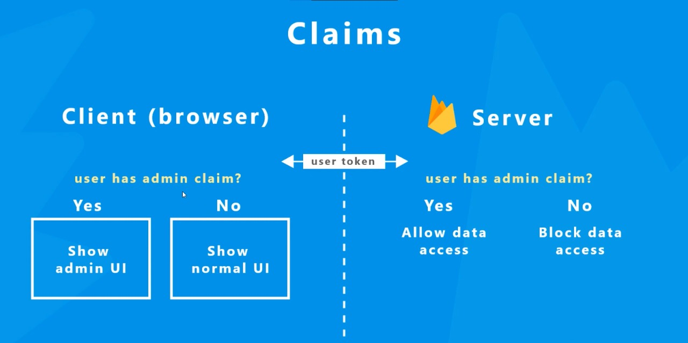
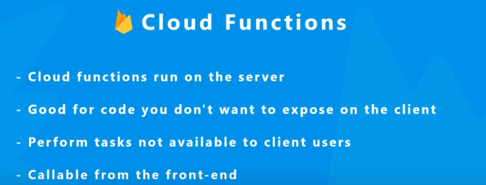
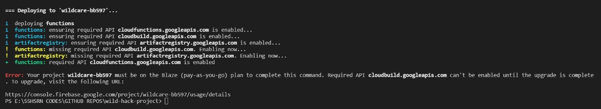
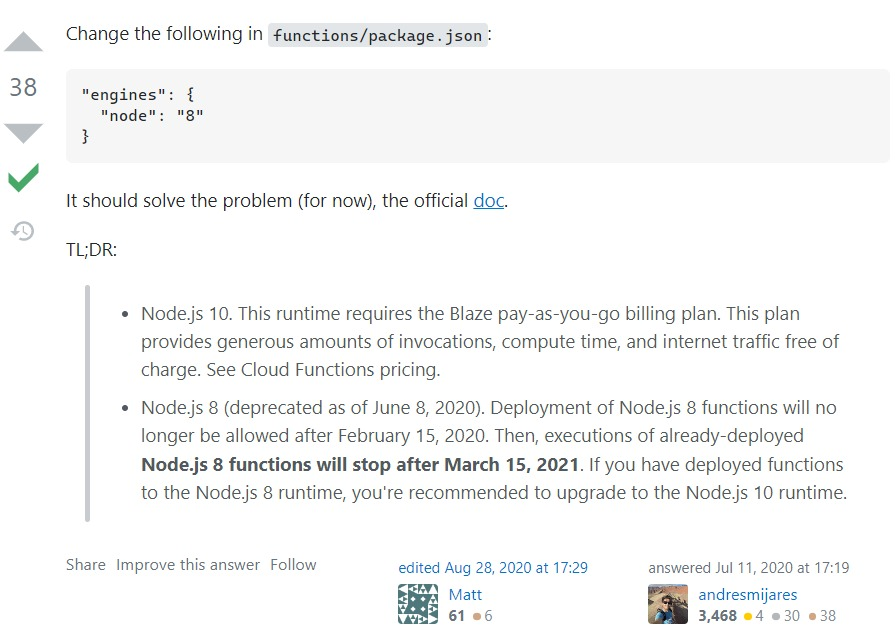
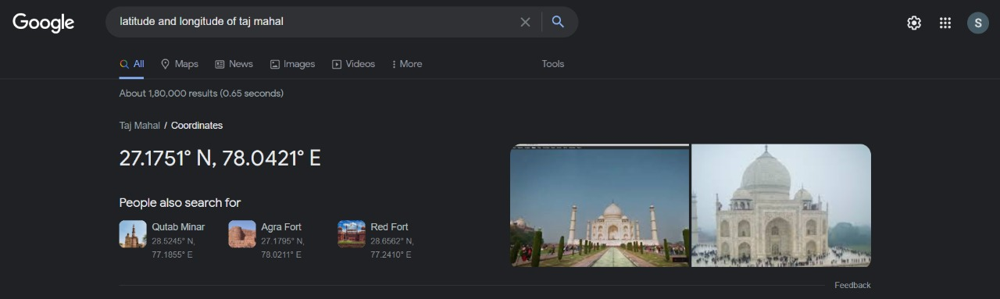
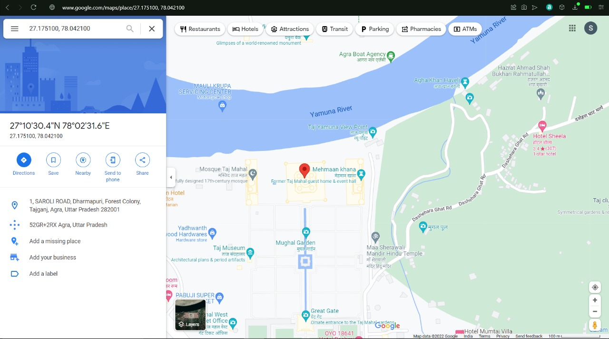

# WildCare

## This project is made for the [WildHacks-2 hackathon](https://organize.mlh.io/participants/events/8333-wildhacks-ii) conducted by [MLH](https://mlh.io/) on August 5 to August 7, 2022.
<br>
This repository was created for just deploying the site as the member went inactive. For commit history, [check this repository](https://github.com/Amanshenoy008/wild-hack-project)

## Design:
We planned and made a wireframe for the project using Figma.<br>
[Click here to see the design](https://www.figma.com/file/tdfnStKSuPCbUv8KpiBOMz/MLH-WildHacks-Hackathon?node-id=0%3A1)

## Planned Features:
* User can login either as a **supporter** or as a **member**.
* Supporters can support to the cause by either providing **monetary assisstance** or by choosing to **manually adopt animals**.
* Members can post details about animals that are homeless in their neighbourhood or has suffered from some **calamities**.
* There will also be an admin user who will keep track of all the exchanges and donations and also ensure that **nothing illegal happens**.
* If a supporter chooses to manually adopt an animal, the directions to the member who is selling the animal for adoption will be dislayed(used Google Maps for this.)

## Some screenshots:

## Challenges and issues:
Due to the **time constraints** and **limited team**, most of the planned features could not be implemented. Even then, we are happy that we learnt a lot.

## Major Lessons learnt:
1. Implementing Admin users(using **cloud functions**) in FireBase requires a paid plan.
    * **Screenshots:**
        1. Custom claims:
        
        2. Cloud Functions(to use custom claims):
        
        3. Error in terminal(while deploying):
        
        4. Reason for error:
        
2. Getting position and directions to a place in map just by using it's **latitude and longitude**(This can be used by the members to share their location to the supporters).
    * **Screenshots:**
        1. Location(Latitude and Longitude):
        
        2. Location(in Google Maps):
        

## Contribute to this project:

- Fork the project:
  Click the gray `Fork` button in the top right of this page. This creates _your_ copy of the project and saves it as a new repository in your github account.

- Click on the green `Code` button, then either the HTTPS or SSH option and, click the icon to copy the URL. Now you have a copy of the project. Thus, you can play around with it locally on your computer.

- Run the following commands into a terminal window (Command Prompt, Powershell, Terminal, Bash, ZSH). Do this to download the forked copy of this repository to your computer.

```bash
  git clone https://github.com/YOUR_GITHUB_USERNAME/WildHacks-II__WildCare.git
```

- Switch to the cloned folder. You can paste this command into the same terminal window.

```bash
  cd WildHacks-II__WildCare
```

- Make a new branch. Your username would make a good branch because it's unique.

```bash
  git checkout -b <name-of-new-branch>
```

- Make the required changes.

- Stage your changes.

```bash
  git add .
```

- Commit the changes.

```bash
  git commit -m "<message>"
```

- Check the status of your repository.

```bash
  git status
```

- The response should be like this:

```bash
On branch <name-of-your-branch>
nothing to commit, working tree clean
```

- Pushing your repository to GitHub.

```bash
  git push origin <name-of-your-branch>
```

or

```bash
  git branch -M main
  git push -u origin main
```

- On the GitHub website, navigate to your forked repo - on the top of the files section, you'll notice a new section containing a `Compare & Pull Request` button!

- Click on that button, this will load a new page, comparing the local branch in your forked repository against the main branch in the WildHacks-II__WildCare repository. Accept the default values in the dropdown boxes and click the green `Create Pull Request` button.  
  Note: A pull request allows us to merge your changes with the original project repo.

- Your pull request will be reviewed and then eventually merged.